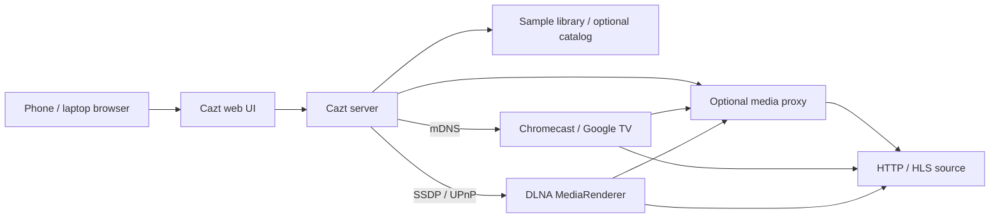

# Cazt

**Choose something. Choose a screen. Cazt it.**

Self-hosted LAN video casting. The browser never talks to your TV. The Cazt server discovers Chromecast and DLNA devices on its own network and sends them something to play.



## What is Cazt?

Cazt is a small home-network app. Open it on a phone, pick a title, pick the living-room TV, and the **server** starts playback. It does not use Chrome's Cast button, `window.cast`, or the browser's device picker.

## Features

- Server-side Chromecast / Google Cast discovery (mDNS) and control
- Server-side DLNA / UPnP MediaRenderer discovery (SSDP) and control
- Device deduplication when the same screen appears on more than one protocol
- Open sample library (Blender films and Cast/HLS test streams)
- Optional media proxy with short-lived tokens, Range requests, and HLS rewriting
- Live device and playback updates over WebSocket
- One binary, one container, mobile-first UI with light and dark mode

## How it works

1. The UI asks the Cazt server for devices and media.
2. The server browses `_googlecast._tcp` and UPnP MediaRenderer / AVTransport.
3. You pick a title and a screen.
4. The server tells that device to play an HTTP or HLS URL the TV can fetch.
5. If the TV cannot reach the source, Cazt can proxy it at `http://LAN-IP:8787/media/<token>`.

## Supported devices / protocols

| Protocol | Discovery | Control | Notes |
| --- | --- | --- | --- |
| Google Cast / Chromecast / Android TV / Google TV | mDNS | Play, pause, resume, seek, stop, volume | Implemented with [oxicast](https://crates.io/crates/oxicast) |
| DLNA / UPnP MediaRenderer | SSDP | Play, pause, resume, seek, stop, volume when RenderingControl exists | Implemented with [rupnp](https://crates.io/crates/rupnp) |

Cazt only lists a device after it has identified a protocol it can actually use. Arbitrary smart TVs are not assumed to be controllable.

## cinejoy.pk

Cazt inspected [cinejoy.pk](https://cinejoy.pk/) before implementing a provider:

- It is a SvelteKit SPA with no public documented catalog or playback API.
- Paths such as `/api` return the app shell, not JSON.
- Client bundles include scrape/player UI, not a first-party media contract.

Cazt **does not scrape cinejoy.pk**, bypass access controls, or resolve unofficial stream URLs. The `cinejoy` media provider is still there so a permitted JSON catalog can be configured later:

```bash
CINEJOY_CATALOG_URL=https://example.com/permitted-catalog.json
```

Until that is set, use the sample library or paste a public URL you already have the right to play.

## Quick start

```bash
git clone <repo>
cd cazt
cp .env.example .env
docker compose up --build
```

Then open [http://127.0.0.1:8787](http://127.0.0.1:8787).

On **Linux**, `docker-compose.yml` uses host networking so multicast discovery can work.

On **Docker Desktop (Windows / macOS)**:

```bash
# set CAZT_PUBLIC_HOST to this PC's LAN IP, plus any known device IPs
docker compose -f docker-compose.desktop.yml up --build
```

## Configuration

See `.env.example`. Important variables:

| Variable | Purpose |
| --- | --- |
| `CAZT_PORT` | HTTP port (default `8787`) |
| `CAZT_PUBLIC_HOST` | LAN IP advertised to TVs for the media proxy. Never `localhost`. |
| `CAZT_LOG` / `CAZT_LOG_FORMAT` | `info` / `pretty` or `json` |
| `CAZT_KNOWN_CAST_HOSTS` | `ip:8009` fallbacks when mDNS cannot reach the container |
| `CAZT_KNOWN_DLNA_LOCATIONS` | Device description URLs when SSDP cannot reach the container |
| `CINEJOY_CATALOG_URL` | Optional permitted JSON catalog |

## Network discovery

Chromecast uses **mDNS** (UDP 5353). DLNA uses **SSDP** (UDP 1900). Both are multicast and stay on one subnet. Guest Wi-Fi, client isolation, VLANs, and many Docker bridge networks will hide TVs.

## Docker networking notes

- **Linux:** `network_mode: host` is the supported path for discovery.
- **Docker Desktop / Windows / macOS:** the VM or WSL2 layer usually does not forward multicast. Discovery will often return nothing unless you set `CAZT_KNOWN_CAST_HOSTS` / `CAZT_KNOWN_DLNA_LOCATIONS`. The UI and proxy still work; TVs must be able to reach `CAZT_PUBLIC_HOST`.
- The proxy URL given to a TV is always a LAN address, never `127.0.0.1`.

## Development

```bash
cp .env.example .env
cd server && cargo run
# another terminal
cd frontend && npm install && npm run dev
```

Vite proxies `/api` and `/media` to `http://127.0.0.1:8787`.

```bash
make test
make lint
make build
```

## Architecture

The server is **Rust + Axum** so Chromecast and DLNA I/O stay async, the binary is small, and Docker images do not need a Python or Node runtime. The UI is **React + TypeScript + Vite + Tailwind**.

```
server/src
  api/           HTTP + WebSocket
  discovery/     Chromecast mDNS, DLNA SSDP, dedup
  cast/          Chromecast + DLNA control
  media/         samples, cinejoy stub, direct URL
  proxy/         token sessions, HLS rewrite, SSRF
```

## API

| Method | Path | Purpose |
| --- | --- | --- |
| GET | `/api/health` | Liveness |
| GET | `/api/devices` | Current device list |
| POST | `/api/devices/refresh` | Scan now |
| GET | `/api/media/search?q=` | Search catalog |
| POST | `/api/cast` | Start playback |
| POST | `/api/playback/pause` | Pause |
| POST | `/api/playback/resume` | Resume |
| POST | `/api/playback/seek` | `{ "seconds": 30 }` |
| POST | `/api/playback/stop` | Stop |
| POST | `/api/playback/volume` | `{ "level": 0.4 }` |
| GET | `/api/playback/status` | Current session |
| GET | `/api/events` | WebSocket updates |

## Security

Cazt is for a **trusted home LAN**. Do not publish it on the internet.

- No arbitrary URL proxy. Media is fetched only for URLs registered on a short-lived session token.
- Outbound fetches are http(s) only and refuse loopback, private, link-local, and metadata addresses.
- HLS child URLs are registered from playlists, not taken from the client.
- Rate limiting on the API, request timeouts, and structured errors.
- Media URLs are redacted in logs.

## Troubleshooting

### Cazt cannot find my TV

Work through this list. Almost every miss is a network path, not the UI.

1. **Same network.** Phone, Cazt server, and TV must share a subnet. Guest Wi-Fi, “AP/client isolation”, and VLANs that do not forward multicast will hide the TV.
2. **Multicast.** Chromecast needs mDNS (UDP 5353). DLNA needs SSDP (UDP 1900). Some mesh Wi-Fi systems drop these.
3. **Docker.** On Linux use host networking. On Docker Desktop, multicast usually never reaches the container — add `CAZT_KNOWN_CAST_HOSTS` or `CAZT_KNOWN_DLNA_LOCATIONS`.
4. **Protocol support.** The TV must speak Google Cast or expose a DLNA MediaRenderer. A smart TV with only a vendor app is not enough.
5. **Firewall.** Allow inbound/outbound UDP 5353 and 1900 on the Cazt host, plus TCP 8009 for Cast control and the TV's UPnP TCP port.
6. **Refresh.** Use **Refresh devices**. Discovery is also repeated in the background.

If the TV appears but will not play, check that the TV can fetch the media URL (or the Cazt proxy on `CAZT_PUBLIC_HOST`), and that the codec is one the device understands. Chromecast is happiest with H.264 MP4 and HLS.

## Known limitations

- cinejoy.pk is not a playable source without an operator-supplied permitted catalog.
- Docker Desktop discovery is unreliable by design of the VM networking model.
- Some DLNA TVs accept `SetAVTransportURI` and still refuse a given MIME type.
- Playback status is best-effort; a device can ignore status queries while still playing.
- IPv6-only unique-local Cast/DLNA networks are not a first-class target.

## Contributing

See [CONTRIBUTING.md](CONTRIBUTING.md).

## License

MIT. See [LICENSE](LICENSE).
